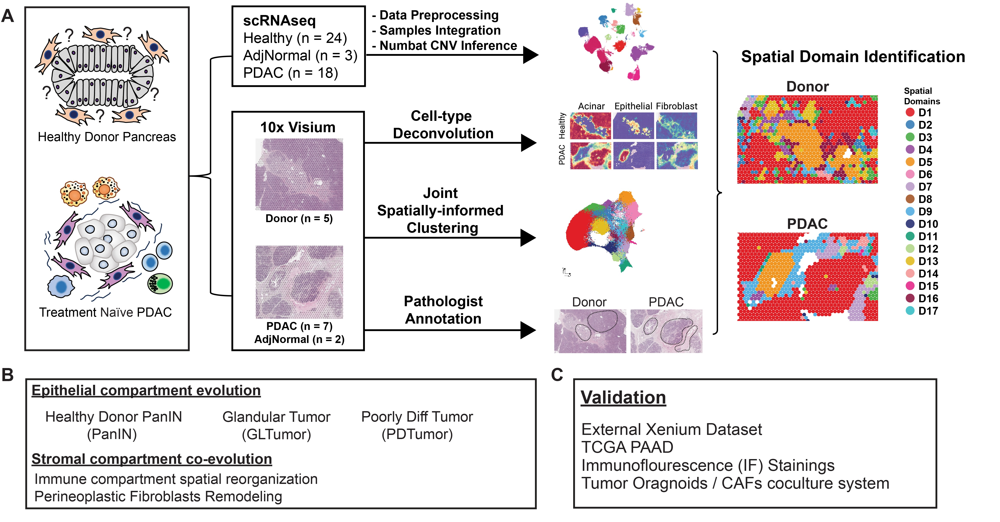

## Introduction
This is documentation for the code used for analysis in [@elhossiny2026asynchronous]. Here, we leverage single-cell RNAseq and spatial transcriptomics data to investigate the epithelial and stromal co-evolution in pancreatic cancer.

## Data
We used a cohort of scRNAseq samples composed of healthy (n = 24), Adjacent normal to tumor (n = 3) and PDAC (n = 18) samples and 10x Visium samples composed of healthy (n = 11), Adjacent normal to tumor (n = 2) and PDAC (n = 7). The samples are integrated from [@elhossiny2026asynchronous], [@carpenter2024krt17high], [@carpenter2023analysis], [@steele2020multimodal] studies. 

## Downloading raw and processed data
<!-- * Raw fastq data can be find in these dbGAP repositories: -->
* Raw data for spatial samples and full resolution H&E are available[here](https://zenodo.org/records/19304282)  
* Raw data for the new scRNAseq samples can be found [here](https://zenodo.org/records/17538974)
* Raw data for the previous studies can be found in these GEO repositories: [GSE229413](https://www.ncbi.nlm.nih.gov/geo/query/acc.cgi?acc=GSE229413), [GSE155698](https://www.ncbi.nlm.nih.gov/geo/query/acc.cgi?acc=GSE155698), [phs003436.v1.p1](https://dbgap.ncbi.nlm.nih.gov/beta/study/phs003436.v1.p1)
* Raw data for organoids samples can be found [here](https://zenodo.org/records/19305784)
* Processed data objects [here](https://zenodo.org/records/19305449) 

<!-- Data acquisition can also be done as described in [scRNAseq Acquisition](scRNAseq_data_acquisiton.qmd) and [Spatial Transcriptomics Acquisition](st_data_acquisition.qmd) -->

## Analysis
The analysis workflow and findings are explained in detail in [@elhossiny2026asynchronous].

### scRNAseq Analysis

* Alignment using CellRanger as detailed here [CellRanger Alignmnet](scRNAseq_CellRanger.qmd)
* Ambient RNA correction using cellbender [@cellbender] as detailed here [scRNAseq Ambient RNA Correction](scRNAseq_cellbender.qmd)
* Quality control, processing and integration as detailed here [scRNAseq Data Processing and Integration](scRNAseq_processing.qmd)
* Copy number variation inference was done using Numbat [@numbat] as described here [CNV Inference using Numbat](scRNAseq_numbat.qmd)
* Fibroblasts and Macrophages subpopulation analysis were done as decribed here [scRNAseq Fibroblast Subpopulation Analysis](scRNAseq_fibro.qmd) and [Macrophages Subpopulation Analysis](scRNAseq_macs.qmd)
* Gene set scoring on TCGA-PAAD dataset was done as described here [TCGA-PAAD Scoring](scRNASeq_TCGA_Scoring.qmd)

### Spatial Transcriptomics Analysis

#### Visium

* Alignment using SpaceRanger was done is described here 
* Data normalization and seurat object generation is described here [Spatial Transcriptomics Data Processing](st_processing.qmd)
* Cell type deconvolution was done using RCTD [@rctd] is described here [Spatial Transcriptomics Cell Type Deconvolution](st_deconvolution.qmd)
* Integration and Spatially-informed clustering using BayesSpace [@BayesSpace] is described here [Spatial Transcriptomics Clustering (BayesSpace)](st_clustering.qmd)
* Ligand-Receptor interaction analysis was done using LIANA+ [@liana] is described here [LIANA+ Analysis](st_LIANA_Analysis.qmd)
* Neighborhood analysis is described here [Spatial Transcriptomics Neighborhood Analysis](st_nhood_analysis.qmd)
* Pseudobulk analysis of epithelial compartment is described here [Spatial Transcriptomics Epithelial Domains Analysis](st_epi_analysis.qmd)
* Pseudobulk analysis of stromal compartment is described here [Spatial Transcriptomics Stromal Domains Analysis](st_stroma_analysis.qmd)

#### Xenium

* Segmentation was done using Proseg [@proseg] is described here [Xenium Resegmentation](st_xenium_segmentation.qmd)
* Data processing and integration is described here [Xenium Data Analysis](st_xenium_processing.qmd)
* Spatial regression was done using semla [@semla] is described here [Xenium Spatial Regression](st_xenium_regression.qmd)
* Visualization of data is done as described here [Xenium Polygons Visualization](st_xenium_viz.qmd)

#### CosMx

* Projection of Fibroblasts signature on external CosMx dataset is described here [CosMx Data Analysis](st_cosmx_processing.qmd)

## Interactive Visualization
You can explore the data interactively on [https://pascadimagliano-lab.github.io/PancAtlas/](https://pascadimagliano-lab.github.io/PancAtlas/)

## Contact us

If you have any questions please feel free to contact the authors, Ahmed M. Elhossiny [(hossiny@umich.edu)](mailto:hossiny@umich.edu) and Marina Pasca di Magliano [(marinapa@umich.edu)](mailto:marinapa@umich.edu)

